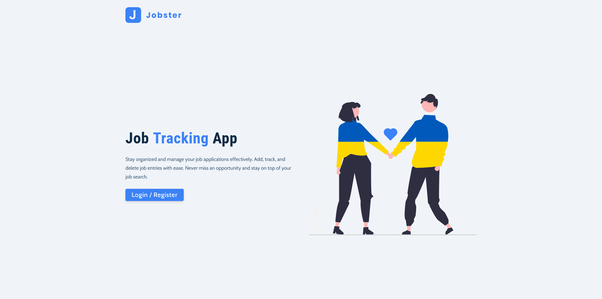
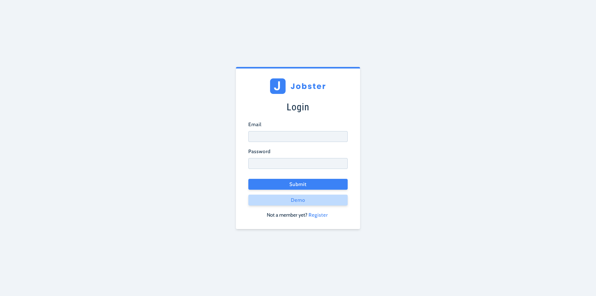
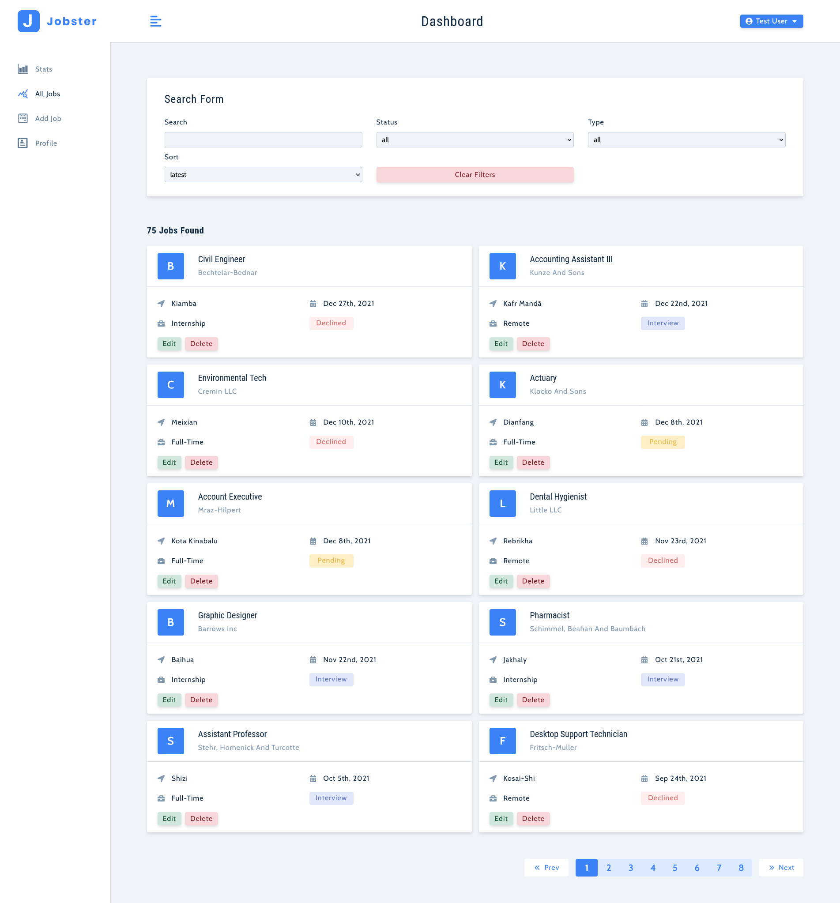

# Jobster

## Built with

- React.js
- axios
- Redux
- styled-components
- CSS
- React Icons
- React Router 6
- React Hooks (useState, useEffect)
- recharts
- React Toastify

## Users should be able to:

- Register or log in to their accounts.
- Use a demo user if they are not willing to register.
- View the stats of their job applications (pending, interviews, declined) and see graphical representations.
- Browse all the jobs they have added.
- Search for jobs and apply filters based on position, location, status, etc.
- Add new job listings.
- Edit their profile information, such as their name, last name, location, and email.
- Please note that users cannot make any changes while using the demo user account. These functionalities are only available for the accounts they have set up.
- Lastly, users can log out, and they will be redirected back to the landing page.

## Links

- Live Site URL: [Jobster](https://jobster-ekizashvilit.netlify.app/landing)
